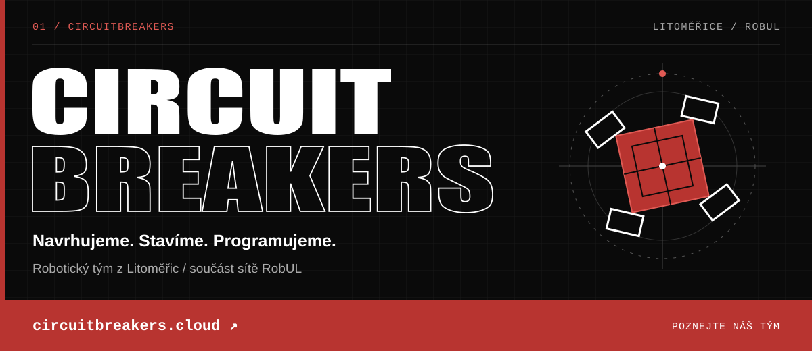
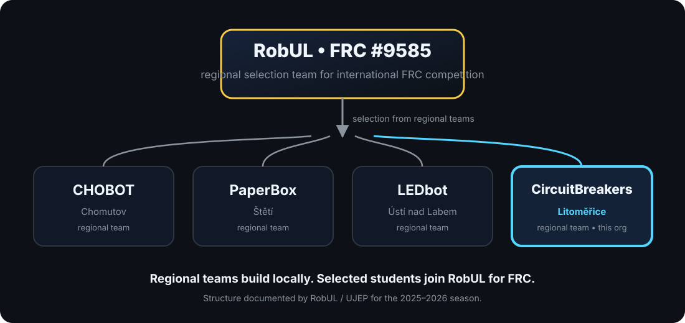

  

  
  
  

# We are CircuitBreakers

**CircuitBreakers** is a high-school robotics team based in **Litoměřice, Czechia**, operating as one of the regional teams in the **RobUL** robotics program.

The important distinction: **CircuitBreakers is not a separate numbered FRC team.** The international FIRST Robotics Competition team is **RobUL, FRC Team #9585**. CircuitBreakers builds and competes locally; selected members can then join the regional RobUL roster for international FRC competition.

We work at the intersection of **robot mechanics, embedded control, autonomous behavior, computer vision, software engineering and competition strategy**. This GitHub organization is where we keep the software side of that work.

  

## What RobUL is

**RobUL (Robot Ústí), FRC Team #9585**, is the Ústí Region's FIRST Robotics Competition team. FIRST lists RobUL as a community team from **Ústí nad Labem** with a **2024 rookie year**. RobUL's own project history describes it as the first FRC team in the Ústí Region and the second in the Czech Republic.

From the 2025/2026 school year, RobUL moved to a regional model built around four local teams:

| Regional team | Base | Relationship to RobUL |
|---|---|---|
| **CHOBOT** | Chomutov | Regional team |
| **PaperBox** | Štětí | Regional team |
| **LEDbot** | Ústí nad Labem | Regional team |
| **CircuitBreakers** | **Litoměřice** | **Regional team — us** |

The model is simple: the regional teams develop students and robots locally; a selection of the most active members represents the region internationally under **RobUL #9585**.

## CircuitBreakers in competition

On **27 November 2025**, UJEP and ICUK held the first Ústí Region robotics competition inspired by FRC. Teams had to solve five challenges — **Laser, Rings, Maze, Moving Objects and Slalom** — in both manual and autonomous modes.

**CircuitBreakers finished 2nd with 16 points**, behind CHOBOT and ahead of PaperBox and LEDbot.

For the **2026 FRC season**, RobUL assembled a 13-student regional roster. **Two students from CircuitBreakers** were part of that team alongside students from CHOBOT, PaperBox and LEDbot.

At the **2026 Denver Regional**, RobUL #9585:

- ranked **34th of 55** after qualification,
- was selected as the **second pick of Alliance 7**,
- reached **Round 4 of the double-elimination playoffs**.

That international run belongs to RobUL #9585 as a whole; CircuitBreakers' role was as one of the regional teams represented on the roster.

## What we build

Our public 2025 regional-competition codebase is a useful snapshot of the kind of engineering we do.

### Robot software

The public robot project is a **WPILib command-based Java** codebase with:

- **swerve drive** configuration and control,
- tele-operated and autonomous drive modes,
- PID/PIDF tuning and motion control,
- safety and low-voltage limiting,
- autonomous maze behavior,
- camera-assisted targeting and scanning,
- dashboard/network telemetry,
- simulation support.

### Vision and coprocessors

The repository also contains a **Python coprocessor** component for QR-based vision work, alongside robot-side subsystems that consume camera/vision data.

### FRC ecosystem

The public 2025 project includes dependencies for tools and libraries such as:

**WPILib · YAGSL · PathPlanner · PhotonVision / PhotonLib · CTRE Phoenix · REVLib · AdvantageKit · MapleSim**

Not every library in a vendordep directory is necessarily central to every robot feature, but together they show the FRC ecosystem the team has been working with.

## Our public code

### [RobUL-2025-Local](https://github.com/CircuitBreakersTKM/RobUL-2025-Local)

Archived public code from the 2025 regional robot work.

The repository includes the robot project, swerve configuration, autonomous routines, camera/vision logic and a coprocessor component. Its commit history also records the practical competition cycle: calibration, autonomous-maze work, QR distance estimation, safety changes, PIDF refinement, competition fixes and later demo preparation.

> We publish what is appropriate to publish. Active competition work may remain private while it is being developed.

## Timeline

| When | Milestone |
|---|---|
| **2024** | RobUL #9585 enters FRC as a rookie team and competes at the Midwest Regional. |
| **2025** | RobUL competes at the Colorado Regional. The regional-team model is established for the 2025/2026 school year. |
| **27 Nov 2025** | CircuitBreakers places **2nd** in the first regional robotics competition in Ústí nad Labem. |
| **Apr 2026** | Two CircuitBreakers students join the 13-student RobUL roster for the Denver Regional. |
| **Apr 2026** | RobUL #9585 reaches the Denver Regional playoffs as part of Alliance 7. |
| **Nov 2026** | RobUL plans the second regional robotics competition, again feeding the selection pathway toward the following FRC season. |

## Mentoring and home base

RobUL's current regional-team page lists **Jindřich Černý** as the CircuitBreakers mentor. The official recap of the 2025 regional competition named **Jan Štěrba and Jindřich Černý** as CircuitBreakers mentors for that event.

Public sources describe CircuitBreakers as a team attached to the **technical-education / technical-club environment in Litoměřice**. The 2026 RobUL roster recap identifies the CircuitBreakers students on the selection team with **Gymnázium Josefa Jungmanna Litoměřice**.

We intentionally do **not** publish a roster of student names here unless those members choose to make themselves public.

## What this organization is for

This GitHub organization exists to make the software side of the team easier to build, review and preserve:

- robot code and configuration,
- autonomous routines and control experiments,
- coprocessor / vision utilities,
- simulation and test tooling,
- technical documentation,
- future open-source projects from the team.

If you are another FRC team, a student interested in robotics, or someone working on similar systems, feel free to explore the public repositories and learn from them.

## Links

- **RobUL:** https://robul.cz/
- **Regional teams / CircuitBreakers:** https://robul.cz/?page_id=956
- **RobUL #9585 on FIRST:** https://frc-events.firstinspires.org/team/9585
- **2026 Denver Regional:** https://frc-events.firstinspires.org/2026/code
- **CircuitBreakers 2025 result — UJEP:** https://prf.ujep.cz/en/30078/the-chobot-team-from-chomutov-won-a-regional-robotics-competition-and-will-fly-to-the-usa
- **RobUL 2026 roster / Denver recap — ICUK:** https://icuk.cz/tym-robul-na-roboticke-soutezi-denver-regional-2026-pribeh-ktery-stoji-za-vypraveni/
- **Public 2025 robot code:** https://github.com/CircuitBreakersTKM/RobUL-2025-Local

## Sources and verification

This profile is deliberately based on public, independently checkable material rather than team lore.

Primary sources used:

1. **FIRST Event Web** — Team 9585 identity, rookie year, seasons and official event participation.
2. **RobUL** — project history and current four-team regional structure.
3. **UJEP Faculty of Science / RUR** — first regional competition format and final standings.
4. **ICUK** — composition of the 2026 RobUL selection team and Denver 2026 recap.
5. **CircuitBreakersTKM/RobUL-2025-Local** — public source code and repository history.

Where public sources use slightly different institutional descriptions for CircuitBreakers, this profile preserves the common verified point: **CircuitBreakers is the Litoměřice regional team in the RobUL system.**

---

  <strong>CircuitBreakers • Litoměřice • RobUL #9585</strong> 
  Build locally. Compete regionally. Represent internationally.

